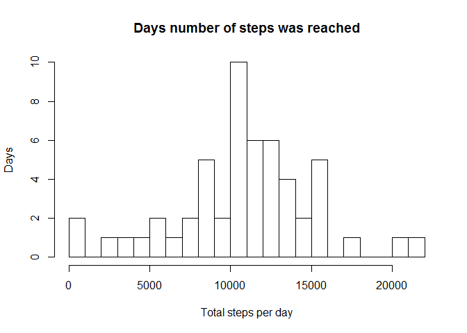
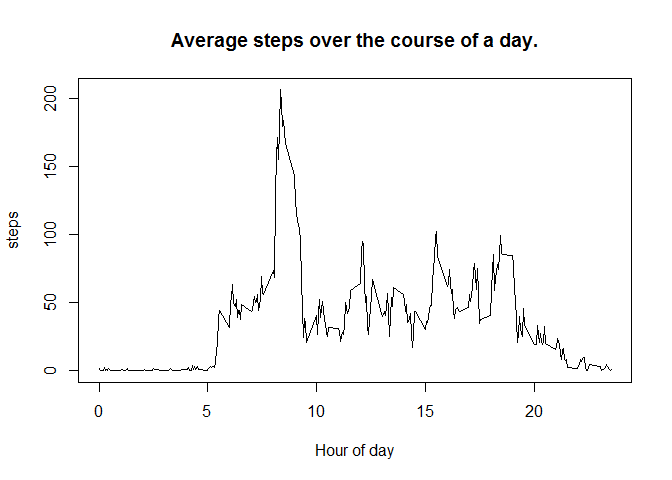
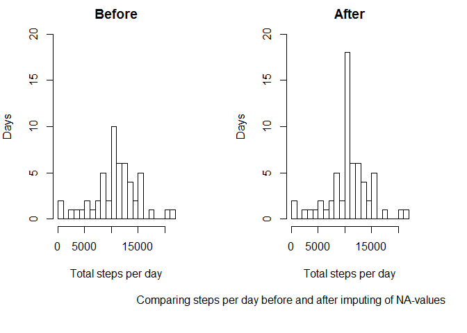
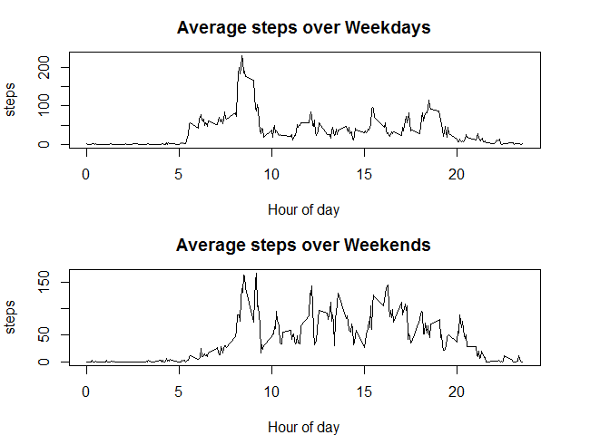

# Reproducible Research: Peer Assessment 1
Marius Peche  
21 January 2017  

## Introduction and summary of the assignment
This assignment aims to determine if the author is able to create an __HTML__ document that describes a set of _Explatory Data Analysis_ steps the author took in order to answer certain questions regarding the given data.

The document needs to explain the basic steps taken, as well as contain any code used and accompanying results that may have been generated.

The questions that needs to be asked are:

  + What is mean total number of steps taken per day?
  + What is the average daily activity pattern?
  + Imputing missing values, and possible impact.
  + Are there differences in activity patterns between weekdays and weekends?

The author needs to be able to _weave_ an _rmd_ file in order to create an _html_ file, using the _knitr_ library from R.


## Loading and preprocessing the data
The data for this assignment can be found [at this link](https://d396qusza40orc.cloudfront.net/repdata%2Fdata%2Factivity.zip). It contains the number of steps recorded for each 5-minute interval by a user of an unidentified personal activity monitoring device. The data that have been supplied was gathered over the months October 2012 - November 2012.

The data has already been downloaded for us and is available in the zip-archive _activities.zip_. We unzip this archive and then load the data with the following segment of code:


```r
fileName <- file.path(getwd(),"activity.zip")
unzip(fileName,exdir=getwd())

fileName <- file.path(getwd(),"activity.csv")
activity <- read.csv(fileName)

head(activity)
```

```
##   steps       date interval
## 1    NA 2012-10-01        0
## 2    NA 2012-10-01        5
## 3    NA 2012-10-01       10
## 4    NA 2012-10-01       15
## 5    NA 2012-10-01       20
## 6    NA 2012-10-01       25
```

This will load the required data into the variable _activity_. However, as can be seen from the sample of data, the values in the _interval_ column are represented as an integer and therefore difficult to read. Therefore, we update add another field called _time_ in a more standardized and readable string with the following:


```r
activity$time <- sprintf("%02i:%02i:00",as.integer(activity$interval/100),(activity$interval%%100))
head(activity)
```

```
##   steps       date interval     time
## 1    NA 2012-10-01        0 00:00:00
## 2    NA 2012-10-01        5 00:05:00
## 3    NA 2012-10-01       10 00:10:00
## 4    NA 2012-10-01       15 00:15:00
## 5    NA 2012-10-01       20 00:20:00
## 6    NA 2012-10-01       25 00:25:00
```


## What is mean total number of steps taken per day?
We can calculate the total number of steps per day by using the _sum_ function and applying it to each unique date with _tapply_. We store this in a variable called _totalsteps_ as follows:


```r
stepstotal <- tapply(activity$steps, activity$date, sum, sumplify=TRUE)
```

We can plot this onto a histogram to get an idea of how often the user walked certain ranges of steps.
For this example we will be using _base plot_ system.

```r
hist(stepstotal, breaks=20,
     xlab="Total steps per day", ylab="Days",main="Days number of steps was reached")
```

<!-- -->

*__NOTE__ that a histogram reports on the frequencies of certain values, whereas a barplot displays differrent values for each record.*


Once we have the total steps per day, we can calculate the mean and median across these values:

```r
mean(stepstotal,na.rm = TRUE) 
```

```
## [1] 10767.19
```

```r
median(stepstotal,na.rm = TRUE) 
```

```
## [1] 10766
```
---


## What is the average daily activity pattern?
In a similar way to how we calculated the total number of steps for each day, we now calculate the mean number of steps for each time interval, this time using _mean_ function but again applying it to each unique interval with _tapply_. This time I save it to a data.frame and add an additional list called _uid_ so that we can plot it better on a graph, as well as another list _time_ to answer the last question.


```r
stepsmean <- data.frame(uid=unique(activity$interval), 
                        time = unique(activity$time),
                        steps = tapply(activity$steps, activity$interval, mean, na.rm=TRUE))
```

Once again, using the __base plot__ system, we draw up a line graph with the code below. We plot _stepsmean$uid/100_ on the x-axis simply to display the hours only in order to make the graph more readable.

```r
plot((stepsmean$uid/100),stepsmean$steps, type="l",
     xlab="Hour of day", ylab="steps", main="Average steps over the course of a day.")
```

<!-- -->

We see how the user's activity fluctuates, being especially active in the morning. To get the exact time interval, we can run the following

```r
stepsmean[which.max(stepsmean$steps),]
```

```
##     uid     time    steps
## 835 835 08:35:00 206.1698
```


## Imputing missing values
Looking again at the first few rows of the data.frame _activity_, we can see that there are __NA__ values within the data set.

```
##   steps       date interval     time
## 1    NA 2012-10-01        0 00:00:00
## 2    NA 2012-10-01        5 00:05:00
## 3    NA 2012-10-01       10 00:10:00
## 4    NA 2012-10-01       15 00:15:00
## 5    NA 2012-10-01       20 00:20:00
## 6    NA 2012-10-01       25 00:25:00
```

We calculate the number of missing values as follows:

```r
sum(is.na(activity$steps))
```

```
## [1] 2304
```

We can make a good assumption of what the values should have been, _(more or less)_, using the average steps we've calculated in segment 2.
So in order to make sure that these __NA__ values doesn't introduce too much of a bias into our analysis we will replace them with the mean of the corresponding time-interval. However, since these are not the true values, we will store the manipulated data in another data.frame, called *activity_alt*. In order to replace all __NA__ values with the corresponding mean-value, we created a function called _impute_ to check each step-value and replace it if needed.


```r
impute <- function(dta){  
    for (i in seq(1,length(dta$steps))){
        if (is.na(dta[i,]$steps)){
            dta[i,]$steps	 <- stepsmean[(stepsmean$uid==dta[i,]$interval),3]
        }
    }
    dta
}

activity_alt <- impute(activity)
```

To see how the imputing of the data affected the overall results, w can create another histogram, using the new data.frame. Here it is displayed with the original histogram for easier comparison.

```r
stepstotal_alt <- tapply(activity_alt$steps, activity_alt$date, sum, sumplify=TRUE)

par(mfcol=c(1,2), mar=c(8,4,2,4))
hist(stepstotal, breaks=20, ylim=c(0,20),
     xlab="Total steps per day", ylab="Days",main="Before") 
hist(stepstotal_alt, breaks=20, ylim=c(0,20),
     xlab="Total steps per day", ylab="Days",main="After") 
mtext("Comparing steps per day before and after imputing of NA-values", side=1, line=5, at=12)
```

<!-- -->


We can see that there is no change in the histograms, except for the significant change in the one value. This will make sense, if all the __NA__ values are exclusively limited to certain dates, which will cause the frequency of days when the user walked the average number of steps to be artificially increased by the number of days we do not have data for.

Though not part of the original assignment, a quick check confirms that all __NA__ values are exclusively limited to certain days, which doesn't have any valid values of their own.

```r
library(dplyr)
has_na <- filter(activity,is.na(steps))
no_na <- filter(activity,!is.na(steps))
any(has_na$date %in% no_na$date)
```

```
## [1] FALSE
```

Since the strategy employed to fill in the missing values relied on the mean number of steps per interval, we do not expect the _mean_ to change. The _median_ on the other hand should be slightly higher since the original median was slightly below the mean and we've now added mean values to the data-set. This is indeed the case as seen below:


```r
mean(stepstotal_alt,na.rm = TRUE)  
```

```
## [1] 10767.19
```

```r
median(stepstotal_alt,na.rm = TRUE) 
```

```
## [1] 10767.19
```

```r
(mean(stepstotal,na.rm = TRUE)  == mean(stepstotal_alt,na.rm = TRUE))
```

```
## [1] TRUE
```

```r
(median(stepstotal,na.rm = TRUE)  == median(stepstotal_alt,na.rm = TRUE))
```

```
## [1] FALSE
```


## Are there differences in activity patterns between weekdays and weekends?

We can create a new variable in the data.frame *activity_alt* to identify which days fall in the weekends with the following:

```r
activity_alt$wend <- weekdays.Date(as.Date(activity_alt$date)) %in% c("Sunday","Saturday")
```

Similar to the code in segment 2, we calculate the mean number of steps over both weekdays and weekends for each time-interval. For simplicity, we create two variables *stepsmean_wday* and *stepsmean_wend* to store the calculations for Weekdays and Weekends respectively.

```r
wday <- activity_alt[!activity_alt$wend,]
stepsmean_wday <- data.frame(uid=unique(wday$interval), 
                             time = unique(wday$time),
                             steps = tapply(wday$steps, wday$interval, mean, na.rm=TRUE)) 
wend <- activity_alt[activity_alt$wend,]
stepsmean_wend <- data.frame(uid=unique(wend$interval), 
                        time = unique(wend$time),
                        steps = tapply(wend$steps, wend$interval, mean, na.rm=TRUE))
```

Finally, we create two plots on top of each other to show how the user's activity changed over the weekends.

```r
par(mfcol=c(2,1), mar=c(4,4,3,4))
plot((stepsmean_wday$uid/100),stepsmean_wday$steps, type="l",
     xlab="Hour of day", ylab="steps", main="Average steps over Weekdays")
plot((stepsmean_wend$uid/100),stepsmean_wend$steps, type="l",
     xlab="Hour of day", ylab="steps", main="Average steps over Weekends")
```

<!-- -->
